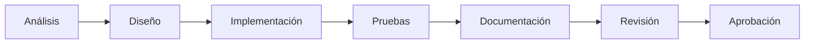

# Cronograma del Proyecto

| Campo | Valor |
|---|---|
| Documento | 01_Gestion_Proyecto/Cronograma.md |
| Versión | 1.0 |
| Fecha de creación | 2026-08-05 |
| Estado | **Pendiente** |
| Fuente | [CLAUDE.md](../../CLAUDE.md), sección 25 |

---

## 1. Objetivo del documento

Registrar la planificación temporal del proyecto (fases, hitos y fechas), una vez que estas sean definidas por el equipo y/o la Parroquia.

## 2. Información disponible actualmente

Aún no se han acordado fechas límite, hitos ni duración de fases con los interesados del proyecto. Lo único definido hasta la fecha es la **metodología** que se seguirá (CLAUDE.md sección 25), de tipo incremental, con el siguiente ciclo por funcionalidad:

## 3. Secciones preparadas para ser completadas

### 3.1 Fases del proyecto

| Fase | Fecha inicio | Fecha fin | Estado |
|---|---|---|---|
| Fase 0 — Fundación documental y arquitectónica | 2026-08-05 | — | En curso |
| Fase 1 — Análisis funcional | — | — | Pendiente de definir |
| Fase 2 — Diseño UI/UX | — | — | Pendiente de definir |
| Fase 3 — Desarrollo | — | — | Pendiente de definir |
| Fase 4 — Pruebas | — | — | Pendiente de definir |
| Fase 5 — Despliegue | — | — | Pendiente de definir |

### 3.2 Hitos

| Hito | Fecha objetivo | Estado |
|---|---|---|
| _Por definir_ | — | Pendiente |

## 4. Estado

**Pendiente.** Este documento se actualizará en cuanto se establezcan fechas concretas con los interesados del proyecto. No se registran fechas estimadas para evitar comprometer plazos no acordados.

---

## Documentos relacionados

- [Vision.md](Vision.md)
- [Bitacora.md](Bitacora.md)
