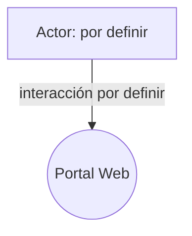

# Casos de Uso

| Campo | Valor |
|---|---|
| Documento | 02_Analisis/Casos_de_Uso.md |
| Versión | 1.0 |
| Fecha de creación | 2026-08-05 |
| Estado | **Pendiente** |

---

## 1. Objetivo del documento

Describir los casos de uso del portal web (interacciones entre los actores y el sistema) una vez que los requerimientos funcionales hayan sido definidos.

## 2. Información disponible actualmente

No existen casos de uso definidos. Este documento depende directamente de [Requerimientos_Funcionales.md](Requerimientos_Funcionales.md), que también se encuentra pendiente.

Los únicos actores que pueden inferirse del contexto actual del proyecto (sin definir aún sus interacciones) son los registrados en [Stakeholders.md](../01_Gestion_Proyecto/Stakeholders.md).

## 3. Secciones preparadas para ser completadas

### 3.1 Formato de caso de uso

| Campo | Descripción |
|---|---|
| ID | CU-XX |
| Nombre | _Por definir_ |
| Actor(es) | _Por definir_ |
| Precondiciones | _Por definir_ |
| Flujo principal | _Por definir_ |
| Flujos alternativos | _Por definir_ |
| Postcondiciones | _Por definir_ |

### 3.2 Diagrama de actores (plantilla)

## 4. Estado

**Pendiente.** Se completará en la fase de Análisis, posterior al levantamiento de requerimientos funcionales.

---

## Documentos relacionados

- [Requerimientos_Funcionales.md](Requerimientos_Funcionales.md)
- [Historias_de_Usuario.md](Historias_de_Usuario.md)
