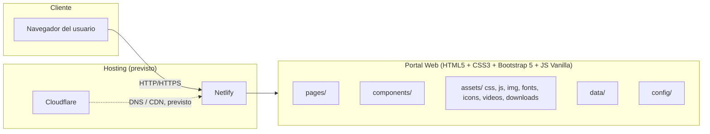

# Arquitectura General

| Campo | Valor |
|---|---|
| Documento | 03_Arquitectura/Arquitectura_General.md |
| Versión | 1.0 |
| Fecha de creación | 2026-08-05 |
| Estado | Vigente (arquitectura definida) / Pendiente (implementación) |
| Fuente | [CLAUDE.md](../../CLAUDE.md), secciones 6, 7, 11, 20 |

---

## 1. Objetivo del documento

Describir la arquitectura general del portal web: su naturaleza, componentes tecnológicos y cómo se relacionan entre sí.

## 2. Naturaleza del sistema

El portal web es un **sitio estático multipágina**, sin backend propio, sin framework de aplicación y sin proceso de build (no existe `package.json` en el repositorio a la fecha). Se construye con HTML5, CSS3, Bootstrap 5 y JavaScript Vanilla, y se sirve directamente como archivos estáticos.

No existe actualmente ningún componente de servidor, base de datos ni API propia. Cualquier necesidad de este tipo debería ser evaluada y autorizada explícitamente, ya que CLAUDE.md restringe las tecnologías backend (sección 6).

## 3. Diagrama de arquitectura (estado objetivo según CLAUDE.md)

> Este diagrama representa la arquitectura **prevista** según CLAUDE.md secciones 11 y 20. A la fecha, el hosting no está configurado (ver [07_Despliegue](../07_Despliegue/Netlify.md)) y las carpetas mostradas existen pero están vacías (ver [Estructura_Proyecto.md](Estructura_Proyecto.md)).

## 4. Principios arquitectónicos

- **Mobile First:** todo el diseño se construye primero para móvil y se escala hacia pantallas mayores (CLAUDE.md sección 7).
- **Bootstrap como base:** Bootstrap 5 es el framework principal; el CSS personalizado complementa, no sobrescribe innecesariamente (sección 7 y 9).
- **HTML5 semántico:** uso de etiquetas semánticas (`header`, `main`, `footer`, `section`, `article`, `aside`, `nav`, etc.) en lugar de `div` genéricos (sección 8).
- **Separación de responsabilidades:** `assets/` para recursos estáticos, `components/` para piezas de interfaz reutilizables, `pages/` para páginas del sitio, `data/` para datos, `config/` para configuración, `scripts/` para utilidades.
- **Sin frameworks de aplicación:** no se introducen frameworks JS de componentes ni backends de servidor de aplicaciones.

## 5. Estado actual de implementación

| Elemento | Estado |
|---|---|
| `index.html` | Existe, vacío (solo boilerplate HTML5) |
| `assets/css`, `assets/js` | Carpetas creadas, sin archivos |
| `components/`, `pages/`, `config/`, `data/`, `scripts/` | Carpetas creadas, vacías |
| Hosting / dominio | No configurado |

## 6. Fuera de alcance actual

No se define aquí ninguna funcionalidad, integración externa activa, ni estructura de datos, ya que el proyecto aún no ha llegado a esa etapa (ver [Alcance.md](../01_Gestion_Proyecto/Alcance.md)).

---

## Documentos relacionados

- [Estructura_Proyecto.md](Estructura_Proyecto.md)
- [Integraciones.md](Integraciones.md)
- [Manual_Tecnico.md](../08_Manuales/Manual_Tecnico.md)
