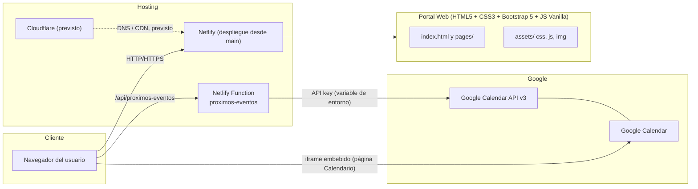

# Arquitectura General

| Campo | Valor |
|---|---|
| Documento | 03_Arquitectura/Arquitectura_General.md |
| Versión | 1.1 |
| Fecha de creación | 2026-08-05 |
| Última actualización | 2026-10-10 |
| Estado | Vigente (arquitectura implementada; ver [Estructura_Proyecto.md](Estructura_Proyecto.md) para el estado de cada carpeta) |
| Fuente | [CLAUDE.md](../../CLAUDE.md), secciones 6, 7, 11, 20 |

---

## 1. Objetivo del documento

Describir la arquitectura general del portal web: su naturaleza, componentes tecnológicos y cómo se relacionan entre sí.

## 2. Naturaleza del sistema

El portal web es un **sitio estático multipágina**, sin framework de aplicación y sin proceso de build (no existe `package.json` en el repositorio a la fecha). Se construye con HTML5, CSS3, Bootstrap 5 y JavaScript Vanilla, y se sirve directamente como archivos estáticos desde Netlify.

Tiene **una única excepción deliberada y autorizada**: una **Netlify Function** (serverless) que consulta Google Calendar API v3 para alimentar la sección «Próximos eventos» de Inicio, de modo que la API key nunca llegue al navegador ni al repositorio público. Es el único componente de servidor del portal; no existe base de datos ni otra API propia. Cualquier otra necesidad de este tipo debería ser evaluada y autorizada explícitamente, ya que CLAUDE.md restringe las tecnologías backend (sección 6): esta excepción no constituye una autorización general. Detalle y justificación en [Integracion_Google_Calendar.md](Integracion_Google_Calendar.md).

## 3. Diagrama de arquitectura (estado actual)

```mermaid
flowchart LR
    subgraph Cliente
        B[Navegador del usuario]
    end

    subgraph Sitio["Portal Web (HTML5 + CSS3 + Bootstrap 5 + JS Vanilla)"]
        P[index.html y pages/]
        A[assets/ css, js, img]
    end

    subgraph Hosting["Hosting"]
        N["Netlify (despliegue desde main)"]
        FN["Netlify Function<br/>proximos-eventos"]
        CF["Cloudflare (previsto)"]
    end

    subgraph Google["Google"]
        GC[Google Calendar]
        API[Google Calendar API v3]
    end

    B -->|HTTP/HTTPS| N
    N --> Sitio
    B -->|"/api/proximos-eventos"| FN
    FN -->|"API key (variable de entorno)"| API
    API --- GC
    B -->|"iframe embebido (página Calendario)"| GC
    CF -.->|DNS / CDN, previsto| N
```

> Netlify aloja el sitio y lo despliega automáticamente desde la rama `main` (URL temporal `.netlify.app`; ver [07_Despliegue](../07_Despliegue/Netlify.md)). Cloudflare y el dominio personalizado siguen **previstos**, no configurados. Las carpetas `components/`, `config/`, `data/` y `scripts/` existen pero están vacías (ver [Estructura_Proyecto.md](Estructura_Proyecto.md)). La integración con Google Calendar se documenta en [Integracion_Google_Calendar.md](Integracion_Google_Calendar.md).

## 4. Principios arquitectónicos

- **Mobile First:** todo el diseño se construye primero para móvil y se escala hacia pantallas mayores (CLAUDE.md sección 7).
- **Bootstrap como base:** Bootstrap 5 es el framework principal; el CSS personalizado complementa, no sobrescribe innecesariamente (sección 7 y 9).
- **HTML5 semántico:** uso de etiquetas semánticas (`header`, `main`, `footer`, `section`, `article`, `aside`, `nav`, etc.) en lugar de `div` genéricos (sección 8).
- **Separación de responsabilidades:** `assets/` para recursos estáticos, `components/` para piezas de interfaz reutilizables, `pages/` para páginas del sitio, `data/` para datos, `config/` para configuración, `scripts/` para utilidades.
- **Sin frameworks de aplicación:** no se introducen frameworks JS de componentes ni backends de servidor de aplicaciones. La Netlify Function de Google Calendar es una excepción puntual autorizada (sección 2), no un backend de aplicación.

## 5. Estado actual de implementación

| Elemento | Estado |
|---|---|
| `index.html` | Página de Inicio implementada |
| `pages/` | `parroquia.html`, `grupos.html` y `calendario.html` implementadas |
| `assets/css` | `variables.css`, `main.css`, `components.css`, `home.css`, `parroquia.css`, `grupos.css` y `calendario.css` |
| `assets/js` | `grupos.js` y `proximos-eventos.js` |
| `netlify/functions/` | `proximos-eventos.mjs` (Netlify Function de Google Calendar) |
| `components/`, `config/`, `data/`, `scripts/` | Carpetas creadas, vacías |
| Hosting | Netlify conectado, despliegue automático desde `main`, URL temporal `.netlify.app` |
| Dominio / Cloudflare | No configurados |
| Integraciones activas | Google Calendar y Netlify (ver [Integraciones.md](Integraciones.md)) |

## 6. Fuera de alcance actual

Este documento no define estructura de datos ni funcionalidades más allá de lo implementado. La única integración externa activa de datos (Google Calendar) se documenta en [Integracion_Google_Calendar.md](Integracion_Google_Calendar.md); el alcance funcional definitivo sigue sujeto a validación con la parroquia (ver [Alcance.md](../01_Gestion_Proyecto/Alcance.md)).

---

## Documentos relacionados

- [Estructura_Proyecto.md](Estructura_Proyecto.md)
- [Integraciones.md](Integraciones.md)
- [Integracion_Google_Calendar.md](Integracion_Google_Calendar.md)
- [Manual_Tecnico.md](../08_Manuales/Manual_Tecnico.md)
