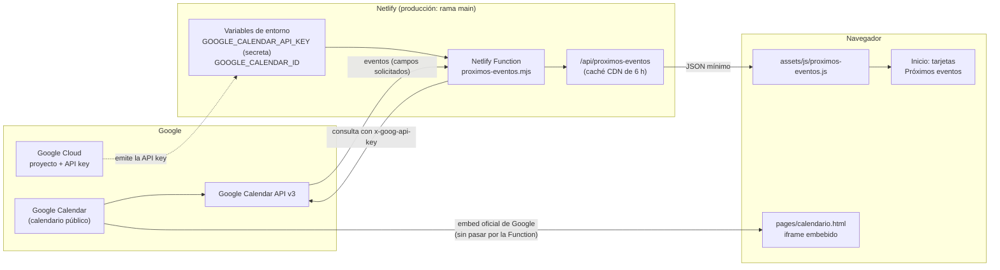

# Integración con Google Calendar

| Campo | Valor |
|---|---|
| Documento | 03_Arquitectura/Integracion_Google_Calendar.md |
| Versión | 1.1 |
| Fecha de creación | 2026-10-10 |
| Última actualización | 2026-10-10 |
| Estado | **Vigente** — integración implementada y en producción; migración al calendario definitivo **pendiente** |
| Fuente | Código del repositorio (`netlify/functions/`, `assets/js/`, `index.html`, `pages/calendario.html`) y configuración confirmada por el equipo del proyecto |

---

## 1. Objetivo y alcance

Google Calendar es la **fuente única de los eventos públicos de la parroquia**. La persona encargada solo crea, modifica o elimina eventos en Google Calendar; no necesita tocar código.

Esos eventos se publican en dos lugares del portal:

| Componente | Qué muestra | Cómo obtiene los datos |
|---|---|---|
| Página **Calendario** ([pages/calendario.html](../../pages/calendario.html)) | El calendario completo | Visualización embebida (iframe) oficial de Google. No usa API key ni la Netlify Function. |
| Sección **Próximos eventos** de **Inicio** ([index.html](../../index.html)) | Los próximos 3 eventos vigentes, en tarjetas | Google Calendar API v3, consultada por una Netlify Function (server-side). Es el tema central de este documento. |

Este documento deja registrado **qué se configuró, dónde, por qué y cómo mantenerlo**, de forma que otra persona pueda comprender, diagnosticar, mantener y migrar la integración sin depender del conocimiento del desarrollador original.

## 2. Convención de certeza de la información

Para no presentar como hecho lo que no se ha podido comprobar, cada afirmación de configuración externa se clasifica así:

| Etiqueta | Significado |
|---|---|
| **[Código]** | Verificado directamente en el código o la estructura del repositorio. |
| **[Equipo]** | Configuración externa (Google Cloud, Google Calendar, Netlify) confirmada por el equipo del proyecto; no es verificable desde el repositorio. |
| **[Por verificar]** | No hay evidencia suficiente; debe comprobarse antes de darlo por cierto. |

**Nunca se documentan** en este repositorio: valores de API keys, contraseñas, tokens, datos de recuperación de cuentas ni direcciones iCal privadas.

## 3. Arquitectura



Flujo de **Próximos eventos**, en texto:

1. La persona administradora crea o edita un evento en Google Calendar.
2. Inicio carga `assets/js/proximos-eventos.js`, que pide `/api/proximos-eventos` al propio sitio.
3. Si no hay una respuesta vigente en la caché, Netlify ejecuta la Function `proximos-eventos`.
4. La Function lee `GOOGLE_CALENDAR_API_KEY` y `GOOGLE_CALENDAR_ID` de las variables de entorno de Netlify y consulta Google Calendar API v3.
5. La Function filtra y normaliza los eventos y devuelve al navegador un JSON mínimo.
6. El script descarta los eventos ya finalizados, toma los 3 primeros y rellena las tarjetas existentes de Inicio.

### 3.1 Por qué una Netlify Function

El navegador no consulta Google Calendar API directamente. Se usa una Function como intermediario porque:

- **Evita exponer la API key en el navegador:** una credencial usada desde JavaScript cliente quedaría visible para cualquiera.
- **Evita almacenar credenciales en un repositorio público:** el repositorio es público; la clave vive solo en las variables de entorno de Netlify.
- **Centraliza la consulta** a Google Calendar API en un único punto.
- **Controla qué información llega al cliente:** el navegador recibe solo los campos necesarios.
- **Normaliza los datos** (texto plano, límites de longitud, instante de finalización).
- **Maneja errores** de forma controlada y uniforme.
- **Aplica caché**, lo que reduce las consultas a Google.
- **Evita que el navegador dependa de una consulta directa** a la API con una credencial.

### 3.2 Excepción serverless autorizada

El portal sigue siendo fundamentalmente un **sitio estático** (HTML5, CSS3, Bootstrap 5 y JavaScript vanilla, sin `package.json` ni proceso de build). La Netlify Function constituye una **excepción deliberada y autorizada** a esa arquitectura, limitada exclusivamente a esta integración. No debe interpretarse como autorización general para añadir backend. Ver [Arquitectura_General.md](Arquitectura_General.md) y [CLAUDE.md](../../CLAUDE.md), sección 29.8.

## 4. Configuración en Google Cloud

Esta integración se configuró con la **cuenta institucional de soporte de la parroquia** **[Equipo]**. El procedimiento realizado, a nivel conceptual, fue:

| # | Paso | Certeza |
|---|---|---|
| 1 | Acceso a Google Cloud con la cuenta institucional de soporte de la parroquia. | [Equipo] |
| 2 | Uso de un proyecto de Google Cloud para la integración. | [Equipo] |
| 3 | Habilitación de **Google Calendar API** en ese proyecto. | [Equipo] |
| 4 | Creación de una **API key** para consultar los datos públicos del calendario. No se usa OAuth: la solución no accede a datos privados ni actúa en nombre de ningún usuario. | [Equipo] |
| 5 | Uso de esa API key **únicamente desde el componente server-side** (la Netlify Function). | [Equipo] y [Código] (el código del navegador no la contiene) |
| 6 | Almacenamiento de la API key como **variable con valor secreto** en Netlify (ver sección 6). | [Equipo] |
| 7 | La API key no aparece en HTML, JavaScript del navegador ni en el repositorio Git. | [Código] |
| 8 | La Function usa la credencial para consultar Google Calendar API. | [Código] |

No se registran aquí el nombre del proyecto de Google Cloud, su identificador ni el valor de la clave (ver sección 12).

**Punto de verificación de seguridad (pendiente).** Verificar en Google Cloud que la API key esté restringida a **Google Calendar API** y únicamente a los servicios requeridos por la solución. Esta restricción técnica **no ha podido comprobarse** desde el repositorio y **no debe darse por confirmada** hasta que se verifique en la consola. Se distingue entre:

- *"la API key fue creada y configurada para esta integración"* — **[Equipo]**, confirmado;
- *"la API key tiene una restricción técnica exclusiva a Google Calendar API"* — **[Por verificar]**.

## 5. Configuración en Google Calendar

- Se utiliza un **calendario secundario dedicado** (llamado «Calendario Parroquial» **[Equipo]**), con zona horaria `America/Costa_Rica` **[Equipo]**, creado y administrado desde la cuenta institucional de soporte de la parroquia.
- El calendario es **TEMPORAL**: sirve para el desarrollo y la configuración. **Antes de la entrega definitiva del TCU debe migrarse** al calendario administrado por la oficina parroquial (ver sección 13).
- Contiene únicamente actividades de carácter **público**, y está disponible para consulta pública mostrando los detalles de los eventos **[Equipo]**. Esto es necesario porque tanto el embed de la página Calendario como la consulta con API key solo pueden leer calendarios públicos.
- Su identificador se entrega a la Function mediante la variable `GOOGLE_CALENDAR_ID`. El ID **no es una credencial secreta** (cualquiera puede verlo en el iframe público de [pages/calendario.html](../../pages/calendario.html)), pero **no se reproduce** en esta documentación.
- **Nunca** debe documentarse ni usarse la dirección iCal **privada/secreta** del calendario.

### 5.1 Regla operativa de uso del calendario

Título, ubicación y descripción de cada evento son **información pública**: no deben incluirse datos privados o internos (teléfonos personales, correos, datos de personas).

| Qué registrar | Qué NO registrar como evento |
|---|---|
| Actividades parroquiales, celebraciones especiales, retiros, cursos, reuniones públicas, actividades comunitarias y otros eventos relevantes para la comunidad. Las misas o celebraciones **especiales** sí pueden registrarse cuando correspondan. | Las **misas ordinarias recurrentes**: el portal ya tiene su propia sección «Horarios de misa» en Inicio. Registrarlas como eventos repetitivos ocuparía las 3 tarjetas de Próximos eventos. |

Esta es una **regla de administración del calendario**: el código no filtra eventos por palabras como «Misa».

## 6. Configuración en Netlify

| Elemento | Valor | Certeza |
|---|---|---|
| Rama de producción | `main` (cada `push` a `main` activa el despliegue) | [Equipo] |
| Carpeta de funciones | `netlify/functions/` (detectada por defecto) | [Código] |
| Function | `netlify/functions/proximos-eventos.mjs` | [Código] |
| Endpoint público | `/api/proximos-eventos` (definido en la propia Function mediante `config.path`) | [Código] |
| `netlify.toml` | **No existe** actualmente | [Código] |
| `_headers`, `_redirects` | **No existen** actualmente | [Código] |
| Directorio de publicación | **Por confirmar** | [Por verificar] |

Las variables se administran en el panel de Netlify (proyecto → variables de entorno). **Nunca** se escriben valores en el repositorio.

### 6.1 Variables de entorno

| Variable | Finalidad | Configuración conocida [Equipo] |
|---|---|---|
| `GOOGLE_CALENDAR_ID` | Identifica el calendario que consulta la Function. **No es secreta.** | Configurada en Netlify y disponible para todos los contextos de despliegue. Actualmente apunta al calendario **temporal** de desarrollo; su valor deberá sustituirse al migrar. |
| `GOOGLE_CALENDAR_API_KEY` | API key creada en Google Cloud para consultar Google Calendar API. **Es secreta.** | Marcada en Netlify como variable con **valor secreto**. Tiene valor **únicamente en Production**; los demás contextos están sin valor. Scopes habilitados: **Builds, Functions y Runtime** (Post processing no está incluido). |

### 6.2 Consecuencia de que la API key exista solo en Production

En un contexto de Netlify sin la variable (vistas previas de despliegue, despliegues de rama u otros que no sean Production), la Function **no puede consultar Google**. Según su manejo de configuración ausente **[Código]**:

- registra en el log solo el **nombre** de la variable faltante (`Falta configurar: …`);
- responde `500` con `{"error":"integracion_no_configurada"}` y sin caché;
- Inicio muestra el mensaje de error controlado y el resto de la página funciona con normalidad.

Por eso la integración real **solo se puede validar en Production**.

## 7. La Netlify Function

Archivo: [netlify/functions/proximos-eventos.mjs](../../netlify/functions/proximos-eventos.mjs). Todo lo siguiente está **[Código]**.

### 7.1 Métodos y endpoint

| Aspecto | Comportamiento |
|---|---|
| Endpoint | `/api/proximos-eventos` |
| Métodos aceptados | `GET` y `HEAD` |
| Otros métodos | `405` con `{"error":"metodo_no_permitido"}` y cabecera `Allow: GET, HEAD` |
| CORS | No se envían cabeceras CORS: el endpoint está pensado para usarse desde el propio sitio |
| Contenido | `application/json; charset=utf-8`, con `X-Content-Type-Options: nosniff` |

### 7.2 Consulta a Google Calendar API v3

La Function consulta `https://www.googleapis.com/calendar/v3/calendars/{calendario}/events`, donde `{calendario}` es el valor de `GOOGLE_CALENDAR_ID` codificado para URL.

| Parámetro | Valor | Para qué |
|---|---|---|
| `singleEvents` | `true` | Expande las instancias de los eventos recurrentes (cada ocurrencia llega como evento individual). |
| `orderBy` | `startTime` | Devuelve los eventos en orden cronológico de inicio. |
| `timeMin` | Instante actual | Google filtra por la hora de **fin** del evento: no devuelve los ya finalizados y sí los que están **en curso**. |
| `maxResults` | `10` | Se piden más eventos de los que se muestran (3) para que el navegador pueda descartar los que terminen mientras la respuesta sigue en caché. |
| `timeZone` | `America/Costa_Rica` | Zona horaria de las fechas y horas devueltas. |
| `fields` | `items(summary,start,end,location,description,status)` | Limita lo que Google devuelve. |

- La **API key** se envía en la cabecera `x-goog-api-key`, **nunca en la URL**.
- Tiempo máximo de espera de la consulta a Google: **8 segundos**.

### 7.3 Campos solicitados a Google

| Campo de Google | Finalidad |
|---|---|
| `summary` | Título del evento. |
| `start` | Fecha y hora de inicio, o solo fecha en eventos de todo el día. |
| `end` | Fecha y hora de finalización. En eventos de todo el día Google entrega el fin de forma **exclusiva** (el día siguiente al último día). |
| `location` | Ubicación pública del evento. |
| `description` | Descripción pública. |
| `status` | Permite descartar los eventos cancelados. |

**No se solicitan** (por lo tanto no llegan ni a la Function): `organizer`, `creator`, `attendees`, correos electrónicos, `reminders`, `htmlLink`, identificadores internos ni ningún otro campo no listado arriba.

### 7.4 Filtrado y transformación

La Function descarta un evento cuando:

- su estado es `cancelled`;
- no tiene título (una vez limpiado el texto);
- su fecha de inicio o de fin no tiene un formato de fecha válido;
- el instante de finalización calculado no es válido.

Con los eventos restantes construye la respuesta. Ver la tabla de la sección 8.

### 7.5 Forma de la respuesta

```json
{
  "generadoEn": "2026-01-01T12:00:00.000Z",
  "zonaHoraria": "America/Costa_Rica",
  "eventos": [
    {
      "titulo": "...",
      "inicio": "2026-01-10T18:00:00-06:00",
      "terminaEn": "2026-01-11T02:00:00.000Z",
      "todoElDia": false,
      "lugar": "...",
      "descripcion": "..."
    }
  ]
}
```

(Los valores del ejemplo son ilustrativos.) `lugar` y `descripcion` valen `null` cuando el evento no los tiene. `generadoEn` indica cuándo se generó la respuesta, lo que sirve para saber qué antigüedad tiene un dato en caché.

### 7.6 Errores y registros (logs)

| Situación | Respuesta | Caché |
|---|---|---|
| Método no permitido | `405` `metodo_no_permitido` | Sin caché |
| Falta `GOOGLE_CALENDAR_API_KEY` o `GOOGLE_CALENDAR_ID` | `500` `integracion_no_configurada` | Sin caché |
| Google no responde, responde con error o el tiempo se agota | `502` `calendario_no_disponible` | 60 segundos |
| Todo correcto (incluye una lista vacía de eventos) | `200` | 6 horas |

**Política de logs:** la Function solo registra información **no sensible**: los *nombres* de las variables que faltan, el *código de estado* y la *razón* que informa Google (solo si es alfanumérica), o el *nombre* del error de red. **Nunca** registra la API key, la URL de la consulta, las cabeceras ni el contenido de las respuestas.

## 8. Mínima exposición de datos

La Function actúa como una capa de reducción de datos: Google puede tener más información de un evento, pero el navegador recibe **solamente lo necesario** para pintar las tarjetas.

| Dato de Google | Dato entregado por la Function | Tratamiento |
|---|---|---|
| `summary` | `titulo` | Texto plano, sin HTML, máximo **100** caracteres. Un evento sin título se descarta. |
| `start` (`dateTime` o `date`) | `inicio` | Se conserva tal cual: fecha y hora con desfase horario, o solo fecha en eventos de todo el día. |
| `start.date` presente y sin `dateTime` | `todoElDia` | Booleano. |
| `end` (`dateTime` o `date`) | `terminaEn` | Instante de finalización en UTC (ISO 8601). En eventos de todo el día: la medianoche de Costa Rica del día siguiente al último día del evento. |
| `location` | `lugar` | Texto plano, máximo **100** caracteres; `null` si está vacío. |
| `description` | `descripcion` | Texto plano: se eliminan las etiquetas HTML, se decodifican entidades básicas (`&amp;`, `&lt;`, `&gt;`, `&quot;`, `&#39;`, `&nbsp;`) y se normalizan los espacios; máximo **140** caracteres (se recorta en el límite de palabra y se añade «…»); `null` si está vacía. |
| `status` | *(no se entrega)* | Solo se usa para descartar los eventos `cancelled`. |
| Cualquier otro dato (organizador, creador, asistentes, correos, recordatorios, enlaces, identificadores) | *(no se solicita ni se entrega)* | — |

No se pretende exponer en ningún caso: correos, asistentes, organizadores, información privada, credenciales ni datos administrativos internos.

## 9. Caché

| Capa | Configuración | Equivale a |
|---|---|---|
| CDN de Netlify (respuesta correcta) | `Netlify-CDN-Cache-Control: public, s-maxage=21600` | **6 horas**, bajo demanda: la respuesta vigente se reutiliza y, cuando expira, la siguiente visita vuelve a consultar a Google. No hay tareas programadas. |
| CDN de Netlify (error `502`) | `public, s-maxage=60` | 60 segundos, para no sobrecargar a Google ni dejar un fallo fijo 6 horas. |
| Respuestas `405` y `500` | `no-store` | Sin caché. |
| Navegador | `Cache-Control: public, max-age=0, must-revalidate` | El navegador siempre revalida; la caché efectiva está en el CDN. |

**Consecuencia operativa para quien administre el portal:** un cambio hecho en Google Calendar (crear, editar o eliminar un evento) **puede tardar hasta 6 horas** en reflejarse en las tarjetas de Inicio. La página **Calendario** funciona distinto: su iframe lo sirve Google directamente, sin pasar por la Function ni por esta caché, y su frecuencia de actualización la define Google.

Esta documentación **no afirma** que un nuevo despliegue invalide la caché del CDN, porque no se ha verificado.

## 10. Comportamiento de «Próximos eventos» en Inicio

Script: [assets/js/proximos-eventos.js](../../assets/js/proximos-eventos.js). Todo lo siguiente está **[Código]**.

### 10.1 Qué hace

1. Consulta `/api/proximos-eventos` (tiempo máximo de espera: 8 segundos).
2. Valida la respuesta: debe incluir la lista `eventos` y la `zonaHoraria`.
3. **Descarta los eventos ya finalizados** (`terminaEn` anterior al momento actual). Esto cubre el caso en que la respuesta provenga de la caché de hasta 6 horas.
4. Los eventos **en curso siguen visibles** hasta que terminan.
5. Usa los eventos en el orden cronológico recibido y muestra como máximo los **3** primeros.
6. Actualiza el texto de las **tarjetas ya existentes**; no crea tarjetas ni cambia el diseño, el CSS ni las imágenes (que siguen siendo de marcador de posición).
7. Inserta todo el contenido con **`textContent`**: nunca interpreta como HTML el texto que viene de Google Calendar.

### 10.2 Estados de la sección

| Situación | Qué se muestra |
|---|---|
| Mientras carga | «Cargando próximos eventos…» (las tarjetas siguen ocultas: nunca se muestra contenido de ejemplo). |
| 3 o más eventos vigentes | 3 tarjetas. |
| 1 o 2 eventos vigentes | Solo esas tarjetas; las demás permanecen ocultas. |
| 0 eventos (o todos ya finalizados) | «Por ahora no hay próximos eventos programados.» |
| Error (respuesta no válida, tiempo agotado, datos con formato inesperado) | «No pudimos cargar los próximos eventos en este momento. Puedes consultarlos en el calendario completo.» |
| Sin JavaScript | Las tarjetas permanecen ocultas y se ve el texto neutro «Consulta los próximos eventos en el calendario completo.» |

El botón **«Ver calendario completo»** (enlace a `pages/calendario.html`) está fuera de las tarjetas y **siempre permanece disponible**.

### 10.3 Datos de cada tarjeta

| Elemento | Contenido |
|---|---|
| Fecha grande | Día (2 dígitos) y mes abreviado de la fecha de **inicio**. |
| Título | `titulo`. |
| Reloj | Horario de inicio y finalización (ver 10.4) o «Todo el día». |
| Ubicación | `lugar`; la línea se **oculta** si el evento no tiene ubicación. |
| Descripción | `descripcion`; el párrafo se **oculta** si el evento no tiene descripción. |

### 10.4 Formato horario (zona `America/Costa_Rica`)

| Caso | Ejemplo mostrado |
|---|---|
| Mismo día | `10:00 a. m. – 12:00 p. m.` |
| Termina exactamente a medianoche del día siguiente | `8:00 p. m. – 12:00 a. m.` (no se añade la fecha del día siguiente) |
| Cruza uno o más días | `6:00 p. m. – 18 oct, 12:00 p. m.` |
| Cruza de año | `10:00 p. m. – 1 ene, 2:00 a. m.` |
| Todo el día, un solo día | `Todo el día` |
| Todo el día, varios días | `Todo el día, hasta el 24 oct` |
| Todo el día, cruza de mes | `Todo el día, hasta el 2 nov` |
| El final no es posterior al inicio | Solo la hora de inicio, por ejemplo `9:30 a. m.` |

La fecha grande de la tarjeta es siempre la de **inicio**. Las horas y los días se calculan en la zona del calendario, no en la del dispositivo del visitante. Se usan espacios no separables en «a. m.», «p. m.» y entre día y mes, para que el texto no se parta de forma incómoda en pantallas pequeñas.

### 10.5 Accesibilidad

- El bloque visual de la fecha tiene `aria-hidden`; por eso el script añade a cada tarjeta un texto visualmente oculto para lectores de pantalla: «Fecha: 9 de octubre de 2026.»
- En eventos que realmente abarcan varios días, ese texto añade «Hasta el 18 de octubre de 2026.»
- El párrafo de estado usa `role="status"`.
- Las cifras de la fecha usan cifras alineadas (`font-variant-numeric: lining-nums` en `home.css`) para que, por ejemplo, «04» no se lea como «o4».

## 11. Página Calendario (visualización embebida)

[pages/calendario.html](../../pages/calendario.html) **no usa la Function ni la API key**: muestra el calendario con el iframe oficial de Google. **[Código]**

| Parámetro del embed | Valor | Efecto |
|---|---|---|
| `src` | Identificador del calendario | Qué calendario se muestra. |
| `ctz` | `America/Costa_Rica` | Zona horaria. |
| `hl` | `es` | Idioma español. |
| `wkst` | `2` | La semana inicia en lunes. |
| `mode` | `MONTH` | Vista mensual por defecto. |
| `bgcolor` | `#ffffff` | Fondo blanco. |
| `showTitle`, `showPrint`, `showTz`, `showCalendars` | `0` | Se ocultan el título, el botón de imprimir, la zona horaria y la lista de calendarios. |

El iframe lleva `loading="lazy"` y un `title` descriptivo. El botón «Abrir en Google Calendar» abre la vista pública del mismo calendario en una pestaña nueva (`target="_blank"`, `rel="noopener noreferrer"`).

**Limitación conocida (verificada durante la validación).** En pantallas muy pequeñas (≈375 px de ancho) la vista **mensual** del embed de Google no cabe en el iframe: se corta la última columna de la semana y los controles «Hoy» y de cambio de vista quedan fuera de vista, sin desplazamiento horizontal para alcanzarlos. La vista **Agenda** sí se lee correctamente en ese ancho. No se ha resuelto; queda pendiente de decisión.

## 12. Registro de administración

| Concepto | Valor | Certeza |
|---|---|---|
| Cuenta responsable de Google Cloud | Cuenta institucional de soporte de la parroquia | [Equipo] |
| Proyecto de Google Cloud | Por confirmar (nombre e ID no se registran en el repositorio) | [Por verificar] |
| API habilitada | Google Calendar API (v3) | [Equipo] |
| Tipo de credencial | API key (sin OAuth) | [Equipo] |
| Restricción técnica de la API key | **Punto de verificación de seguridad**: comprobar que esté restringida a Google Calendar API | [Por verificar] |
| Responsable administrativo de la integración | Por confirmar | [Por verificar] |
| Cuenta propietaria del calendario actual | Cuenta institucional de soporte de la parroquia (calendario **temporal**) | [Equipo] |
| Nombre del calendario actual | «Calendario Parroquial» (calendario secundario dedicado) | [Equipo] |
| Cuenta propietaria del sitio en Netlify | Por confirmar | [Por verificar] |
| Fecha de configuración | Por completar (el trabajo asociado se registra en la Sesión 11 de [Bitacora_Horas_TCU.md](../01_Gestion_Proyecto/Bitacora_Horas_TCU.md)) | [Por verificar] |
| Estado de migración al calendario definitivo | **Pendiente** | — |

Este registro **nunca** debe contener API keys, contraseñas, tokens, direcciones iCal privadas ni datos de recuperación de cuentas.

## 13. Migración pendiente al calendario definitivo de la oficina parroquial

> **Pendiente formal antes de la entrega final del TCU.** La solución usa hoy un calendario **temporal** asociado a la cuenta institucional de soporte. El objetivo es que la oficina parroquial administre el calendario definitivo y que la solución no dependa de la cuenta de soporte del proyecto.

> **Relación con el congelamiento temporal (2026-10-10):** el congelamiento de la estructura de Calendario e Inicio ([Manual_Tecnico.md](../08_Manuales/Manual_Tecnico.md), sección 9) **no cierra ni modifica** esta migración, ni la incorporación de eventos reales, ni la limitación del embed a ≈ 375 px: siguen pendientes.

Hay **dos componentes independientes** que deben actualizarse.

### 13.1 A. Próximos eventos (Inicio)

1. Crear o identificar el calendario definitivo en la cuenta oficial de la oficina parroquial.
2. Configurarlo para publicar únicamente información destinada a la comunidad (público, con detalles de los eventos visibles) y con zona horaria `America/Costa_Rica`.
3. Obtener su **Calendar ID**.
4. Sustituir el valor de `GOOGLE_CALENDAR_ID` en las variables de entorno de Netlify.
5. Realizar el despliegue necesario para que la Function utilice la nueva configuración.
6. Probar `/api/proximos-eventos` (ver sección 14).
7. Verificar las tarjetas de «Próximos eventos» en Inicio.

La lógica de la Function y del JavaScript de Inicio **no cambia**: no hay ningún ID escrito en ellos.

### 13.2 B. Página Calendario

Actualizar **por separado** [pages/calendario.html](../../pages/calendario.html): el `src` del iframe y el enlace «Abrir en Google Calendar» deben apuntar al calendario definitivo. Validar en escritorio y en móvil.

> **Cambiar `GOOGLE_CALENDAR_ID` en Netlify NO modifica automáticamente el iframe ni el enlace de `pages/calendario.html`.** El identificador del iframe está escrito en ese archivo HTML y debe cambiarse manualmente.

### 13.3 Validación final de la migración

- [ ] Calendario y Próximos eventos muestran el **mismo calendario definitivo**.
- [ ] No quedan referencias funcionales al calendario temporal.
- [ ] No se expusieron secretos durante la migración (nada de claves ni direcciones iCal privadas en Git, capturas o documentos).
- [ ] Se actualizó el registro de administración (sección 12) y la [Bitacora.md](../01_Gestion_Proyecto/Bitacora.md).

## 14. Mantenimiento y diagnóstico

### 14.1 Cómo comprobar la integración

- **Endpoint:** abrir `/api/proximos-eventos` del sitio de producción en el navegador, o consultarlo con `curl`. Debe devolver un JSON con solo `generadoEn`, `zonaHoraria` y `eventos`. Si no hay eventos vigentes, `eventos` será una lista vacía.
- **Antigüedad del dato:** comparar `generadoEn` con la hora actual; indica cuánto tiempo lleva en caché la respuesta.
- **Caché:** la cabecera `Cache-Status` de la respuesta indica si fue servida desde el CDN de Netlify.
- **Logs de la Function:** en el panel de Netlify, en los registros de las Functions (la ubicación exacta puede variar con la interfaz de Netlify). Solo contienen información no sensible (ver 7.6).
- **Variables de entorno:** en el panel de Netlify (proyecto → variables de entorno). Se puede comprobar que existan y en qué contextos tienen valor, pero el valor de la API key, al ser secreta, no se puede volver a leer.

### 14.2 Tabla de diagnóstico

| Síntoma | Qué verificar | Acción recomendada |
|---|---|---|
| Un evento nuevo no aparece en Inicio | La caché (hasta 6 h): revisar `generadoEn`. Que el evento sea futuro o esté en curso. Que tenga título. Que no esté cancelado. Que el calendario y el evento sean públicos. | Esperar a que expire la caché y volver a consultar el endpoint. Corregir el evento en Google Calendar si falla alguna condición. |
| El evento aparece en Calendario pero no en Inicio | Calendario usa el embed de Google (sin caché de 6 h); Inicio usa la Function. Además, que no haya más de 10 eventos anteriores a él. | Esperar la caché. Verificar el endpoint. |
| El endpoint responde `502` | Los logs de la Function muestran el estado y la razón informados por Google. Posibles causas: Google Calendar API deshabilitada, API key inválida o revocada, calendario inexistente o no público, falta de disponibilidad de Google. | Corregir según la razón. Si es la API key, ver «Rotación de API key». Recordar que el `502` se cachea 60 s. |
| El endpoint responde `500` `integracion_no_configurada` | Los logs indican qué variable falta. La API key solo tiene valor en **Production**. | Configurar la variable faltante en el contexto correspondiente, o validar en Production. |
| API key inválida o revocada | Logs con un estado de error de Google y su razón. | Rotar la API key. |
| Se muestra otro calendario o ninguno | El valor de `GOOGLE_CALENDAR_ID` en Netlify y la visibilidad pública del calendario. | Corregir `GOOGLE_CALENDAR_ID` y redesplegar. |
| Se cambió `GOOGLE_CALENDAR_ID` y no se nota el cambio | Que se haya realizado un nuevo despliegue. Que no haya una respuesta antigua en caché (revisar `generadoEn`). | Redesplegar y esperar la expiración de la caché si persiste. |
| `/api/proximos-eventos` devuelve `404` | Que `netlify/functions/proximos-eventos.mjs` exista en `main` y que el último despliegue haya terminado sin errores. | Revisar el estado del despliegue en Netlify. |
| Las tarjetas no se rellenan y se ve un mensaje de error | La consola y la pestaña de red del navegador; el estado del endpoint. | Seguir el diagnóstico del endpoint. |
| No funciona en local | Sirviendo los archivos con un servidor estático local (por ejemplo `python -m http.server`) **no existe** `/api/proximos-eventos`, porque la Function depende del entorno de Netlify. | Es lo esperado: Inicio mostrará el mensaje de error. La integración se valida contra Production. |

### 14.3 Rotación de la API key

1. En Google Cloud, crear una nueva API key para el proyecto de la integración y aplicarle las restricciones de seguridad (ver sección 4).
2. Actualizar el valor de `GOOGLE_CALENDAR_API_KEY` en Netlify (Production), manteniéndola como variable secreta.
3. Realizar el despliegue necesario para que la Function use el nuevo valor.
4. Comprobar `/api/proximos-eventos` y las tarjetas de Inicio.
5. Eliminar o desactivar la API key anterior en Google Cloud.
6. **Nunca** copiar la clave en el repositorio, en documentos, en capturas ni en mensajes. Si se sospecha que una clave fue expuesta, rotarla de inmediato.

### 14.4 Checklist de seguridad y mantenimiento

- [ ] La API key no aparece en el repositorio, en `index.html` ni en ningún JavaScript del navegador.
- [ ] `GOOGLE_CALENDAR_API_KEY` sigue marcada como valor secreto en Netlify.
- [ ] La API key está restringida a Google Calendar API (punto de verificación pendiente, sección 4).
- [ ] El calendario contiene únicamente información pública.
- [ ] No se usa ni se documenta ninguna dirección iCal privada.
- [ ] Las misas ordinarias recurrentes no se registran como eventos.
- [ ] La respuesta del endpoint contiene solo los campos de la sección 8.
- [ ] El script de Inicio inserta el contenido con `textContent`.
- [ ] El registro de administración (sección 12) está actualizado.

## 15. Validación realizada y limitaciones

### 15.1 Validación durante la implementación

- **Netlify Function** con respuestas de Google simuladas y credenciales ficticias: lista blanca de campos, normalización a texto plano y recorte, cálculo del instante de finalización de eventos de todo el día, respuestas `405`, `500` y `502`, cabeceras de caché, uso de la clave en cabecera, y ausencia de la clave, del ID y de correos en la respuesta y en los logs.
- **Navegador** con datos simulados: 0, 1, 2 y 3 eventos, eventos finalizados y en curso, eventos de todo el día y de varios días, formatos horarios de la sección 10.4, errores, respuesta lenta, texto con HTML mostrado como texto, y ausencia de desbordamiento horizontal a 375, 768 y 1280 px.
- **Producción:** `/api/proximos-eventos` responde JSON con solo `generadoEn`, `zonaHoraria` y `eventos`, y la cabecera `Cache-Status` indicó que la respuesta fue almacenada en el CDN.

Estas pruebas se ejecutaron con scripts temporales que **no forman parte del repositorio**, por lo que no constituyen evidencias formales del [Plan_Pruebas.md](../06_Pruebas/Plan_Pruebas.md).

### 15.2 Limitaciones conocidas

- Los cambios en Google Calendar pueden tardar hasta 6 horas en verse en Inicio (sección 9).
- La descripción se recorta a 140 caracteres y los enlaces dentro de las descripciones solo se muestran como texto (la dirección se descarta al limpiar el HTML).
- Las imágenes de las tarjetas son marcadores de posición: Google Calendar no administra imágenes de eventos.
- No hay categorías, colores ni filtros por palabras; es un solo calendario.
- El endpoint solo existe en el entorno de Netlify (no en un servidor estático local) y la API key solo existe en Production.
- La vista mensual del embed de la página Calendario no se ve completa a ≈375 px (sección 11).

## 16. Datos por confirmar

- Nombre e identificador del proyecto de Google Cloud.
- Restricción técnica de la API key (punto de verificación de seguridad).
- Responsable administrativo de la integración tras la entrega.
- Cuenta propietaria del sitio en Netlify.
- Directorio de publicación en Netlify.
- Fecha de configuración de Google Cloud y Netlify.

---

## Documentos relacionados

- [Integraciones.md](Integraciones.md)
- [Arquitectura_General.md](Arquitectura_General.md)
- [Estructura_Proyecto.md](Estructura_Proyecto.md)
- [Netlify.md](../07_Despliegue/Netlify.md)
- [Checklist_Despliegue.md](../07_Despliegue/Checklist_Despliegue.md)
- [Manual_Tecnico.md](../08_Manuales/Manual_Tecnico.md)
- [JavaScript.md](../05_Desarrollo/JavaScript.md)
- [Diseno_Conceptual_Aprobado.md](../04_Diseno/Diseno_Conceptual_Aprobado.md)
- [Bitacora.md](../01_Gestion_Proyecto/Bitacora.md)
- [Bitacora_Horas_TCU.md](../01_Gestion_Proyecto/Bitacora_Horas_TCU.md)
- [CLAUDE.md](../../CLAUDE.md)
