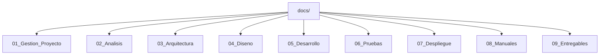

# Documentación — Portal Web Parroquia San Rafael Arcángel

Índice oficial de la documentación del proyecto, organizada según la estructura definida en [CLAUDE.md](../CLAUDE.md), sección 14.

**Leyenda de estado:** ✅ Vigente · 🟡 Parcial · ⏳ Pendiente

## Ruta de lectura recomendada para nuevas incorporaciones

Si te incorporas al proyecto por primera vez, léelos en este orden antes de tocar cualquier archivo:

1. [CLAUDE.md](../CLAUDE.md) — gobierno técnico del proyecto, fuente única de verdad.
2. [Vision.md](01_Gestion_Proyecto/Vision.md) y [Objetivos.md](01_Gestion_Proyecto/Objetivos.md) — qué se está construyendo y por qué.
3. [Alcance.md](01_Gestion_Proyecto/Alcance.md) — qué está dentro y fuera del proyecto.
4. [Arquitectura_General.md](03_Arquitectura/Arquitectura_General.md) y [Estructura_Proyecto.md](03_Arquitectura/Estructura_Proyecto.md) — cómo está organizado el repositorio.
5. [Manual_Tecnico.md](08_Manuales/Manual_Tecnico.md) — estado técnico actual y cómo previsualizar el sitio.
6. [Convenciones.md](05_Desarrollo/Convenciones.md), [Bootstrap.md](05_Desarrollo/Bootstrap.md), [HTML.md](05_Desarrollo/HTML.md), [CSS.md](05_Desarrollo/CSS.md), [JavaScript.md](05_Desarrollo/JavaScript.md) — estándares obligatorios antes de escribir código.
7. [Bitacora.md](01_Gestion_Proyecto/Bitacora.md) — historial de eventos y decisiones (incluye control de cambios).

## 01. Gestión del Proyecto

| Documento | Estado |
|---|---|
| [Vision.md](01_Gestion_Proyecto/Vision.md) | ✅ Vigente |
| [Objetivos.md](01_Gestion_Proyecto/Objetivos.md) | ✅ Vigente |
| [Alcance.md](01_Gestion_Proyecto/Alcance.md) | 🟡 Parcial |
| [Cronograma.md](01_Gestion_Proyecto/Cronograma.md) | ⏳ Pendiente |
| [Bitacora.md](01_Gestion_Proyecto/Bitacora.md) | ✅ Vigente (incluye Control de Cambios, CLAUDE.md sección 15) |
| [Stakeholders.md](01_Gestion_Proyecto/Stakeholders.md) | 🟡 Parcial |

## 02. Análisis

| Documento | Estado |
|---|---|
| [Requerimientos_Funcionales.md](02_Analisis/Requerimientos_Funcionales.md) | ⏳ Pendiente |
| [Requerimientos_No_Funcionales.md](02_Analisis/Requerimientos_No_Funcionales.md) | ✅ Vigente |
| [Casos_de_Uso.md](02_Analisis/Casos_de_Uso.md) | ⏳ Pendiente |
| [Historias_de_Usuario.md](02_Analisis/Historias_de_Usuario.md) | ⏳ Pendiente |

## 03. Arquitectura

| Documento | Estado |
|---|---|
| [Arquitectura_General.md](03_Arquitectura/Arquitectura_General.md) | ✅ Vigente |
| [Estructura_Proyecto.md](03_Arquitectura/Estructura_Proyecto.md) | ✅ Vigente |
| [Integraciones.md](03_Arquitectura/Integraciones.md) | 🟡 Previstas, no implementadas (incluye convención para documentación futura) |

## 04. Diseño

| Documento | Estado |
|---|---|
| [Guia_Estilos.md](04_Diseno/Guia_Estilos.md) | 🟡 Parcial |
| [Componentes_UI.md](04_Diseno/Componentes_UI.md) | 🟡 Registro de uso real, sin implementar (inventario canónico vive en Bootstrap.md) |
| [Wireframes.md](04_Diseno/Wireframes.md) | ⏳ Pendiente |

## 05. Desarrollo

| Documento | Estado |
|---|---|
| [Convenciones.md](05_Desarrollo/Convenciones.md) | ✅ Vigente |
| [Bootstrap.md](05_Desarrollo/Bootstrap.md) | ✅ Vigente |
| [HTML.md](05_Desarrollo/HTML.md) | ✅ Vigente |
| [CSS.md](05_Desarrollo/CSS.md) | ✅ Vigente |
| [JavaScript.md](05_Desarrollo/JavaScript.md) | ✅ Vigente |

## 06. Pruebas

| Documento | Estado |
|---|---|
| [Plan_Pruebas.md](06_Pruebas/Plan_Pruebas.md) | ⏳ Pendiente |
| [Evidencias.md](06_Pruebas/Evidencias.md) | ⏳ Pendiente |
| [Checklist_Calidad.md](06_Pruebas/Checklist_Calidad.md) | 🟡 Plantilla vigente |

## 07. Despliegue

| Documento | Estado |
|---|---|
| [Netlify.md](07_Despliegue/Netlify.md) | ⏳ Pendiente |
| [Dominio.md](07_Despliegue/Dominio.md) | ⏳ Pendiente |
| [Cloudflare.md](07_Despliegue/Cloudflare.md) | ⏳ Pendiente |
| [Checklist_Despliegue.md](07_Despliegue/Checklist_Despliegue.md) | 🟡 Plantilla vigente |

## 08. Manuales

| Documento | Estado |
|---|---|
| [Manual_Tecnico.md](08_Manuales/Manual_Tecnico.md) | 🟡 Vigente (sección de Mantenimiento pendiente) |
| [Manual_Usuario.md](08_Manuales/Manual_Usuario.md) | ⏳ Pendiente |

## 09. Entregables

| Documento | Estado |
|---|---|
| [Entrega_01.md](09_Entregables/Entrega_01.md) | ✅ Completada |
| [Entrega_02.md](09_Entregables/Entrega_02.md) | ⏳ Pendiente |

## Nota sobre documentos adicionales

`Stakeholders.md`, `Checklist_Calidad.md` y `Checklist_Despliegue.md` no están listados explícitamente en la estructura mínima de CLAUDE.md sección 14, pero se añadieron amparados en su cláusula de extensión y en los requisitos de documentación de la sección 15 (stakeholders, checklist de calidad, checklist de despliegue).

## Nota sobre revisión crítica (2026-08-05)

Tras una auditoría documental inicial se evaluó crear cuatro documentos nuevos (Control de Cambios, detalle de integraciones, manual de mantenimiento, glosario). Tras una segunda revisión crítica se decidió **no crear ninguno** de ellos como archivo nuevo, para no introducir duplicación ni contenido especulativo, y en su lugar ampliar documentos ya existentes ([Bitacora.md](01_Gestion_Proyecto/Bitacora.md), [Integraciones.md](03_Arquitectura/Integraciones.md), [Manual_Tecnico.md](08_Manuales/Manual_Tecnico.md)). El detalle de esta decisión está registrado en [Bitacora.md](01_Gestion_Proyecto/Bitacora.md).

## Gobierno documental

Toda la documentación se rige por [CLAUDE.md](../CLAUDE.md), fuente única de verdad del proyecto.
